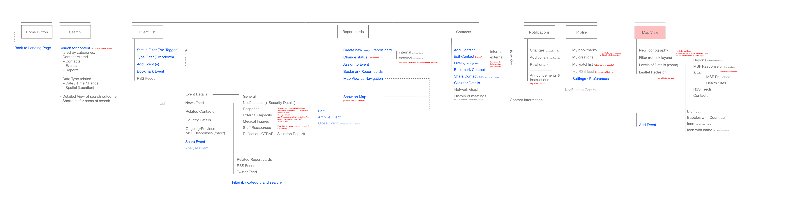

# Refactor into Components
The goal of this sub-directory is to address the following concerns:
    1. REACH production site is currently built as **long HTLM pages** under `Public/` directory with backend routing logic. Which leads to slow loading time and hard refreshes of the entire page.

    2. Instead of static pages rendering, we expanded on the use of **Vue.js** as a front-end framework to develop a component-based architecture. Where each feature is isolated in its own modular to be interpolated with each other and render onto the dashboard. This allows for quick scaling and incremental migration without breaking the codebase.
    # 

    3. Built as a fully fledge frontend application including CRUD operations, authentication, routing, state and data storage. Which alleviate the backend from User Interface logic and routing control. A centralize way of data cacheing in the Vuex Store instead of littering cookies in browser clients.

# Vue Architecture

    > build
        configuration code for development environments
    > src
        assets/ << Stylesheets, icons
        common/ << API services
        component/ << Features - component
        views/ << Features - smaller views
        lib/ << Third-party javascripts
        router/ << Routing logic
        store/ << Data Cacheing Local storage
        App.vue
        Main.js << Root Vue file
    > static
        contains images/assets
    > dist
        compiled code for production builds


Project demo is available at https://ux.msf-reach.org/#/

Project tracking is here
[UI | UX Workplan](https://github.com/MSFREACH/msf-reach/projects/1) repo.

## Getting started

1. [RealWorld guidelines](https://github.com/gothinkster/realworld/tree/master/spec) for implementing a new framework,
2. [RealWorld frontend instructions](https://github.com/gothinkster/realworld-starter-kit/blob/master/FRONTEND_INSTRUCTIONS.md)
3. [Realworld API endpoints](https://github.com/gothinkster/realworld/tree/master/api)
4. [Vue.js styleguide](https://vuejs.org/v2/style-guide/index.html). Priority A and B categories must be respected.

The stack is built using [vue-cli webpack](https://github.com/vuejs-templates/webpack) so to get started all you have to do is:

``` bash
# install dependencies
> npm install

Other commands available are:

``` bash
# build for production with minification
npm run build

# run unit tests
npm run test
```

# To know
- Vuex modules for store
- Vue-axios for ajax requests

# To run
dev > `node app/build/dev-server.js` on port 8080
build > node build/build.js
also 'npm run start' on port 8001
*Note*: Vue Router is replacing server side routing in
    `app/src/router/index.js`
